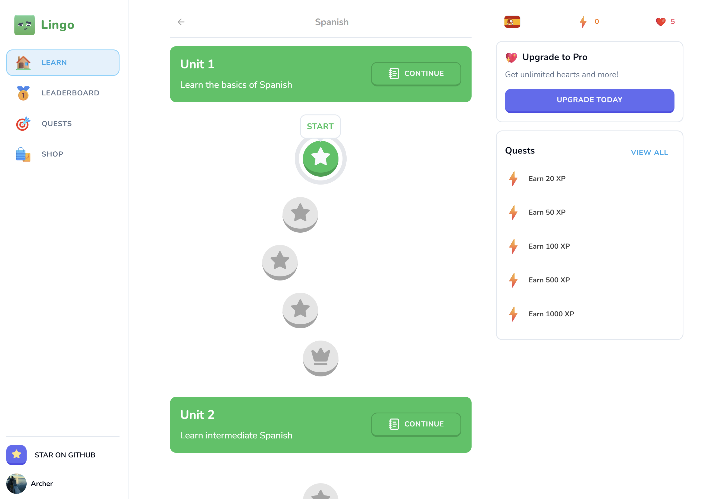

# Lingo

Lingo aims to provide a super interactive and user-friendly platform for learning languages, regardless of your proficiency. Whether you’re just starting out or aiming to perfect your skills, this web app is loaded with features to make your language learning journey both enjoyable and effective. Dive in and discover a whole new way to learn!

## Screenshot



<p align="center">
  <a href="https://archer-lingo.vercel.app"><strong>View Project »</strong></a>
</p>

## Running Locally

This application requires Node.js v20.12.1+.

### Cloning the repository to the local machine:

```bash
git clone https://github.com/archerzou/language-learning.git
cd language-learning
```

### Installing the dependencies:

```bash
npm install
```

### Setting up the `.env` file:

```bash
cp .env.example .env
```

> [!IMPORTANT]
> Ensure you populate the variables with your respective API keys and configuration values before proceeding.

### Configuring Drizzle:

```bash
npm run db:push
```

### Seeding the application:

```bash
npm run db:seed
```

### Running the application:

```bash
npm run dev
```

## Tech Stack

- **Language**: [TypeScript](https://www.typescriptlang.org)
- **Framework**: [Next.js](https://nextjs.org)
- **Styling**: [Tailwind CSS](https://tailwindcss.com)
- **Analytics**: [Vercel Analytics](https://vercel.com/analytics)
- **State Management**: [Zustand](https://docs.pmnd.rs/zustand/getting-started/introduction)
- **ORM Toolkit**: [Drizzle](https://orm.drizzle.team/docs/overview)
- **Postgres Database**: [Neon](https://neon.tech/docs/introduction/about)
- **Authentication**: [Clerk](https://clerk.com/docs/quickstarts/nextjs)
- **Payments**: [Stripe](https://stripe.com/docs/payments)
- **Deployment**: [Vercel](https://vercel.com)

## Acknowledgements

- **Speech Generator**: [ElevenLabs](https://elevenlabs.io)
- **Character Assets**: [Kenney](https://kenney.nl/assets/toon-characters-1)

## Credits

Huge props to Antonio for coming up with such an incredible tutorial. Knowledge packed content, as always!
